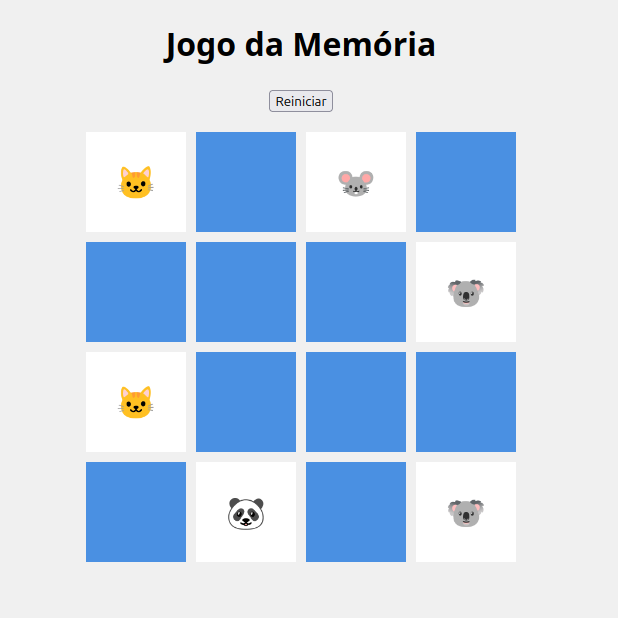

# 🧠 Jogo da Memória

Projeto simples e interativo de **Jogo da Memória**, desenvolvido com HTML, CSS e JavaScript puro.  
Inclui testes automatizados com **Cypress**, ideais para prática de QA e uso em portfólio.

---

## 📸 Demonstração



---

## 🚀 Funcionalidades

- Tabuleiro com 16 cartas embaralhadas
- Cartas reveladas ao clique
- Detecção automática de pares
- Reinício do jogo com botão
- Mensagem de vitória ao acertar todos os pares

---

## 🧪 Testes Automatizados com Cypress

Foram implementados testes E2E utilizando o Cypress, cobrindo os seguintes cenários:

- Carregamento do tabuleiro com 16 cartas
- Comportamento de cartas ao clique
- Detecção de pares e não-pares
- Reinício do jogo
- Fluxo completo de vitória

> ⚠️ **Nota:** Os testes automatizados ainda estão sendo **refinados e expandidos**.  
> Futuras melhorias incluirão:
> - Testes mais robustos para diferentes combinações de cartas
> - Testes de cenários negativos para validação das funções
> - Testes de acessibilidade
> - Testes mobile (responsividade)
> - Cobertura de estados de erro e interações rápidas
> - Fatoramento dos testes

---

## 🛠️ Tecnologias Utilizadas

- HTML5
- CSS3
- JavaScript (ES6)
- Cypress (para testes automatizados)

---

## 📦 Como executar localmente

### 1. Clone o repositório
```bash
git clone https://github.com/seuusuario/jogo-da-memoria.git
cd jogo-da-memoria
```

### 2. Instale as dependências
```bash
npm install
```

#### 🛠️ Como executar o projeto localmente

##### Opção 1: Usando o Live Server (VS Code)
1. Abra o arquivo `index.html` no VS Code
2. Clique com o botão direito e selecione **"Open with Live Server"**
3. O navegador abrirá em: `http://127.0.0.1:5500/`

##### Opção 2: Usando http-server (Node.js)
1. Instale o http-server (se ainda não tiver):
```bash
npm install -g http-server
```
2. No terminal, execute:
```bash
http-server . -p 3000
```
3. Acesse no navegador: http://localhost:3000/

### 3. Execute os testes com Cypress
```bash
npx cypress open
```

### 👨‍💻 Autor

#### Desenvolvido por Lucas Osses
Estudante de QA e entusiasta de automação de testes.

### 📌 Licença

Este projeto está licenciado sob a Licença MIT.

---

📦 Por um QA em evolução, rumo à excelência.